WATFLOOD Parameter Limits
================
James Bomhof
August 9, 2018

Description
===========

This is an analysis to evaluate the limits of the parameters used in WATFLOOD. This analysis is available on a pdf or at <https://github.com/jimmybom/WATFLOOD_Parameters> where you can find the most up-to-date code and parameter sets. If you would like to add your own parameter set to this analysis, please contact <jbomhof@lwcb.ca>.

The analysis is meant to be used as a starting point for model calibration. I have used these data to set parameter limits using the [Ostrich Calibration Software](http://www.eng.buffalo.edu/~lsmatott/Ostrich/OstrichMain.html). The analysis ingests the available parameter sets and collates them to a single data set. Percentiles are calculated for each parameter to give the user a range and median. Boxplots are generated for each landclass parameter where each column differentiates the different landclasses (e.g. forested, shrub, wetland, etc). Boxplots are also generated for River classes but are instead differentiated by basin because there is no common structure as to how river classes are spatially defined. All of the output is stored in the [Output folder](https://github.com/jimmybom/WATFLOOD_Parameters/tree/master/Output), and also shown below.

Parameter Sets
--------------

Parameter sets have been collected from thesis and user datasets. Please see the reference section for a complete list of sources. The parameter sets have been copied to a common structure in csv format and are stored in the [ParameterSets folder](https://github.com/jimmybom/WATFLOOD_Parameters/tree/master/ParameterSets). The naming convention of a parameter set is: **ParameterType\_Source\_SetNum\_Basin.csv**, where:

-   **ParameterType** is either Land (Landclass) or River (RiverClass)
-   **Source** is where the parameter set came from (typically an author of the thesis)
-   **SetNum** is a numeric value to differentiate different sets if there are multiple parameter sets by the same source
-   **Basin** is the basin that the parameter set was created for, please label this 'Basin' if you don't know what to put here.

The parameter sets are stored in the same format as the \*\_par.csv file, with the columns representing the classes, and the rows representing a parameter. Please look at one of the files as an example.

Output
======

Summary Table
-------------

|    X| Parameter    |       min|        max|    fifth|  ninetyfifth|   median|
|----:|:-------------|---------:|----------:|--------:|------------:|--------:|
|    1| a5           |    0.9850|  9.850e-01|   0.9850|       0.9850|   0.9850|
|    2| ak           |   -1.0000|  4.000e+02|  -0.1000|      99.9400|   9.0000|
|    3| ak2          |    0.0000|  9.600e-01|   0.0000|       0.3341|   0.0502|
|    4| ak2fs        |    0.0000|  9.600e-01|   0.0000|       0.5155|   0.0240|
|    5| akfs         |   -1.0000|  4.000e+02|  -0.1000|      99.9700|   2.0000|
|    6| alb          |    0.0000|  1.800e-01|   0.1100|       0.1800|   0.1100|
|    7| base         |  -99.0000|  1.120e+01|  -2.5000|       2.7300|  -0.9580|
|    8| ds           |    0.0000|  1.200e+10|   0.0000|     122.1000|   1.0000|
|    9| dsfs         |    0.0000|  2.200e+10|   0.0000|     220.0000|   2.0000|
|   10| fcap         |    0.1500|  1.000e+00|   0.1500|       0.1500|   0.1500|
|   11| ffcap        |    0.0800|  1.000e+00|   0.1000|       0.1000|   0.1000|
|   12| flint        |    1.0000|  1.000e+00|   1.0000|       1.0000|   1.0000|
|   13| flz          |    0.0000|  7.500e-01|   0.0000|       0.0046|   0.0000|
|   14| fm           |    0.0510|  8.140e-01|   0.0600|       0.4212|   0.1120|
|   15| fmn          |    0.0000|  1.370e-01|   0.0000|       0.1000|   0.1000|
|   17| fratio       |    0.6000|  1.500e+00|   0.7050|       1.4650|   1.0000|
|   19| kcond        |    0.0163|  1.000e+01|   0.1000|       2.0000|   0.2320|
|   20| mndr         |    1.0000|  1.500e+00|   1.0000|       1.1250|   1.0000|
|   21| pwr          |    1.2400|  3.920e+00|   1.5800|       3.8400|   2.7500|
|   22| r1           |    0.0040|  2.000e+00|   0.0075|       2.0000|   0.4000|
|   23| r2           |    0.0010|  3.862e+00|   0.0019|       1.5340|   0.0175|
|   24| r3           |    0.0000|  9.200e+02|   0.0090|      84.8000|   8.9800|
|   25| r3fs         |    0.0000|  5.000e+02|   0.0400|      30.0000|  10.0000|
|   26| r4           |    0.0000|  1.000e+01|   0.3800|      10.0000|  10.0000|
|   27| rec          |    0.0000|  4.120e+01|   0.0002|       3.9510|   0.5060|
|   28| retn         |    0.0000|  4.560e+02|   0.0000|     313.5000|  50.0000|
|   29| rho          |    0.3300|  6.000e-01|   0.3300|       0.3330|   0.3330|
|   30| spore        |    0.2500|  1.000e+00|   0.3000|       0.3325|   0.3000|
|   31| sublim\_rate |    0.0000|  4.000e-01|   0.0100|       0.4000|   0.1100|
|   32| theta        |    0.1000|  2.500e+00|   0.1107|       1.0000|   0.3920|
|   33| tipm         |    0.1000|  2.000e-01|   0.1000|       0.2000|   0.1000|
|   34| whcl         |    0.0350|  5.000e-02|   0.0350|       0.0400|   0.0350|

Plots
-----

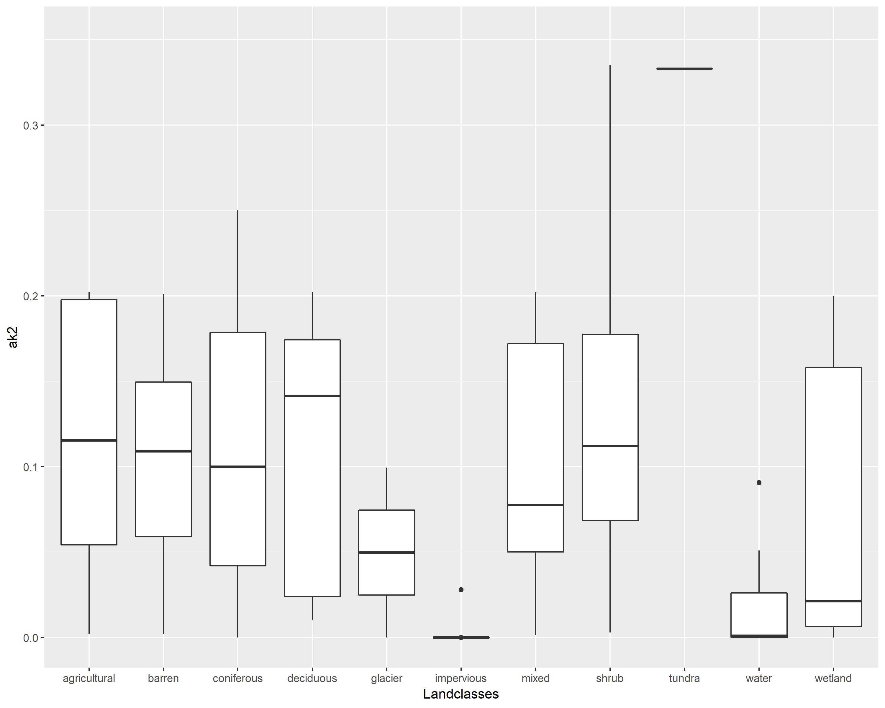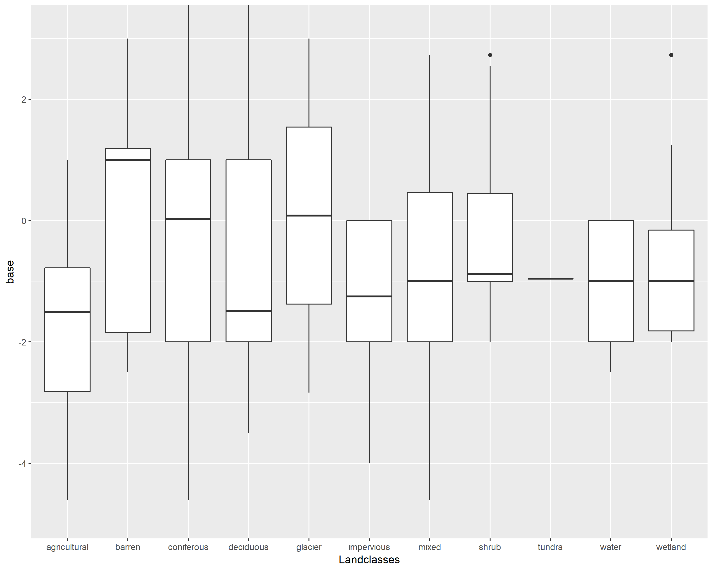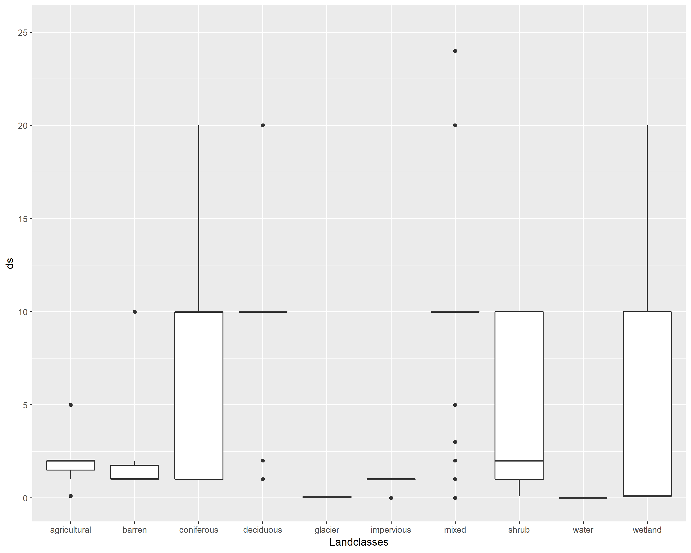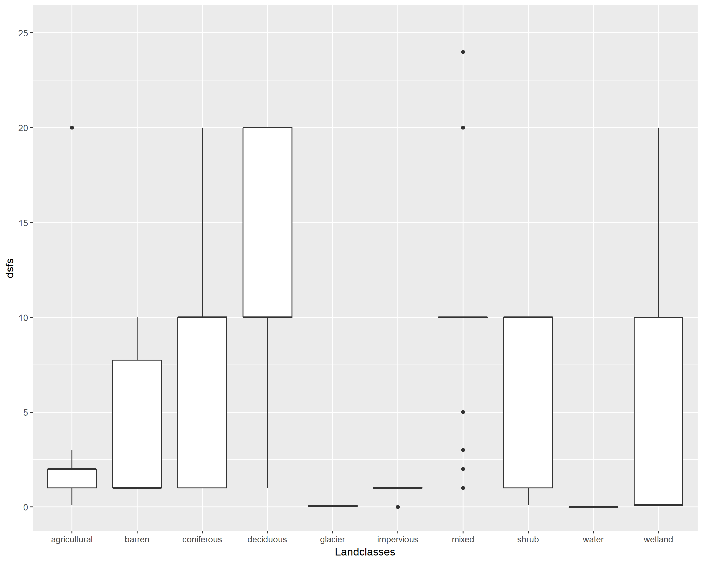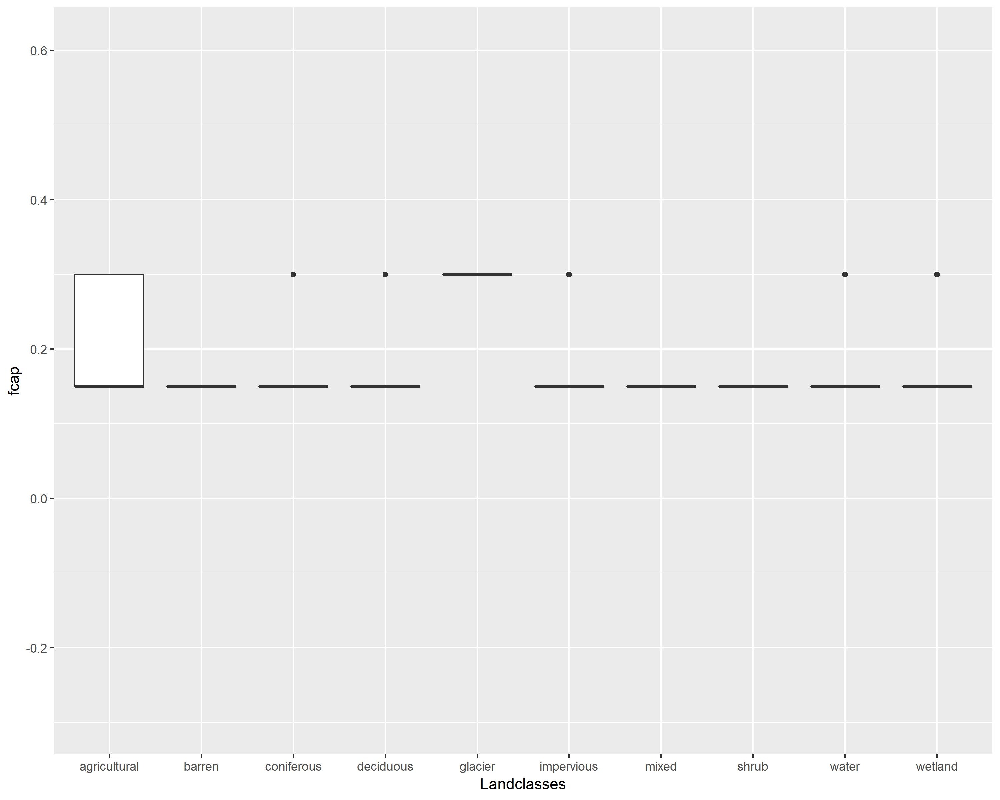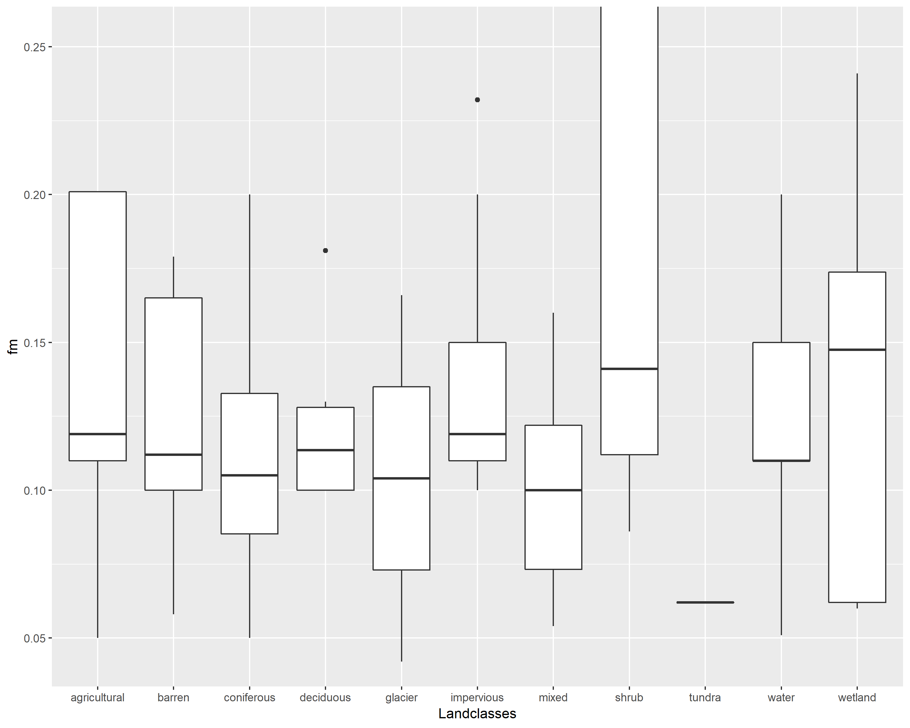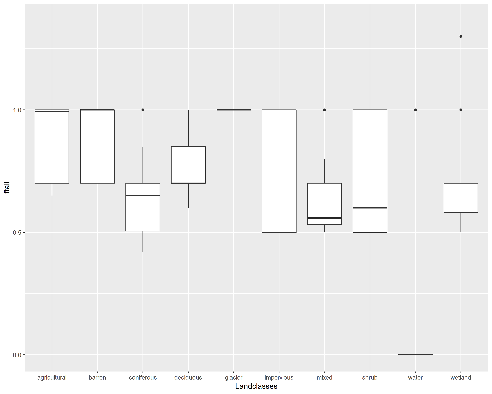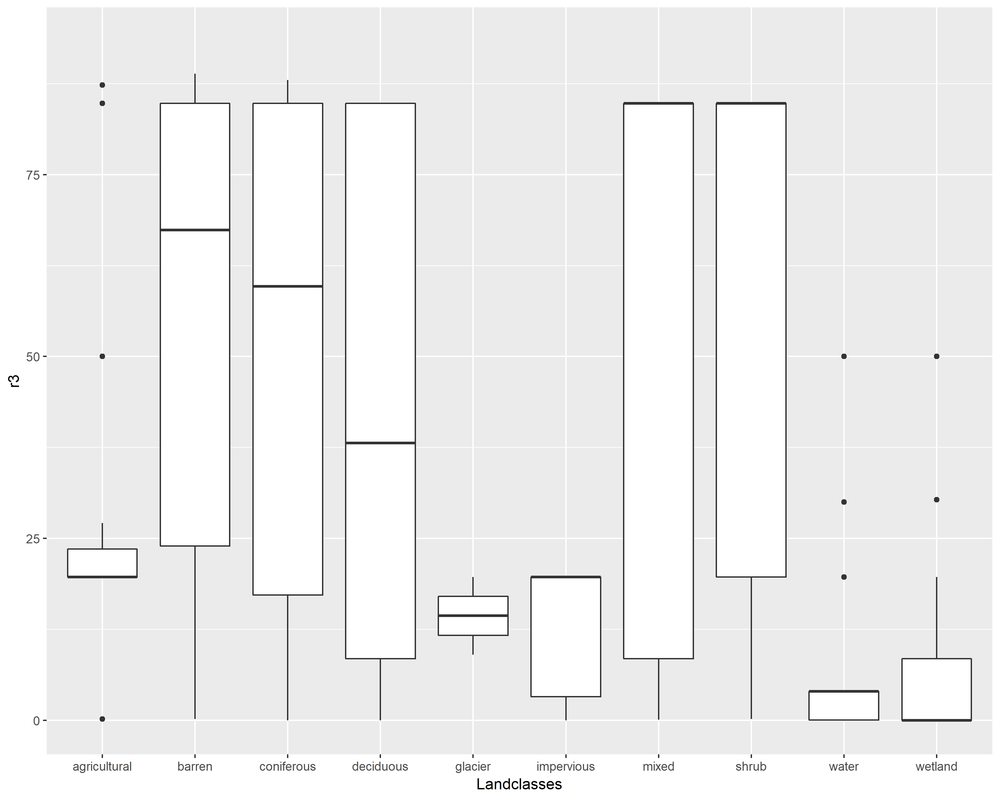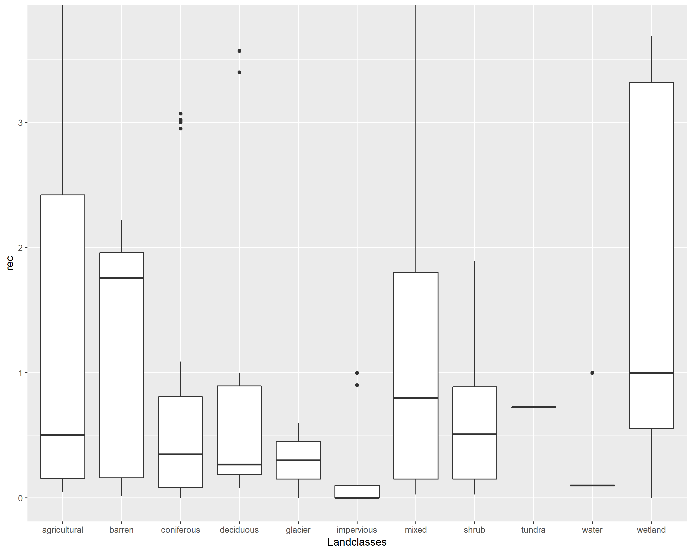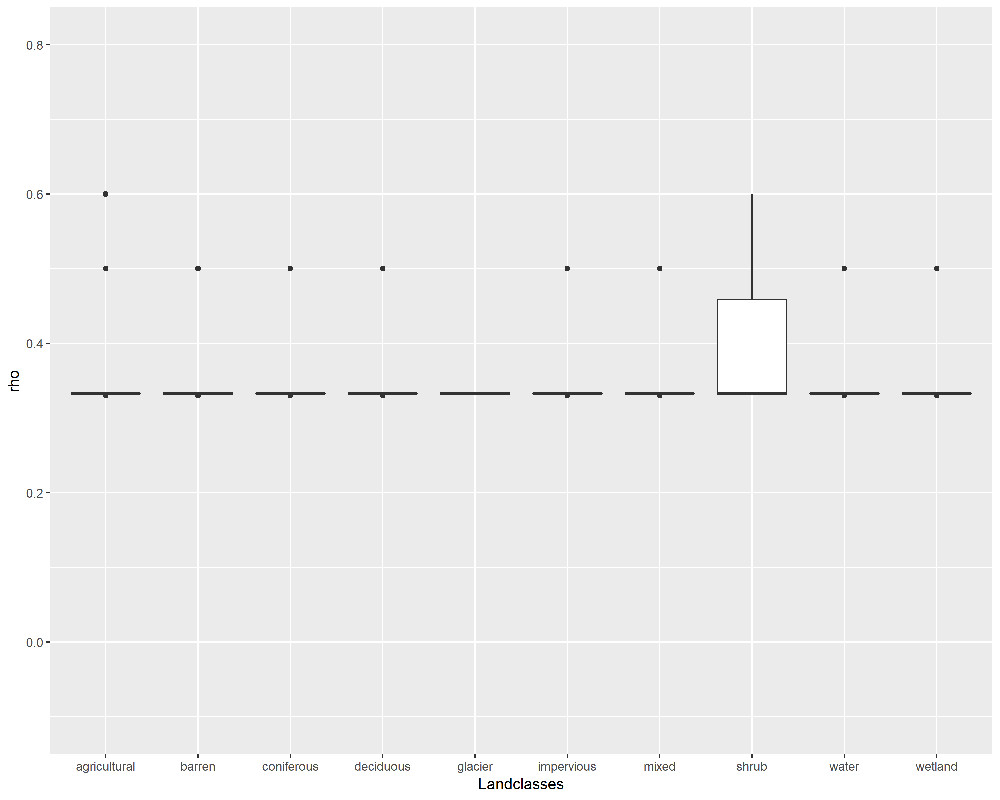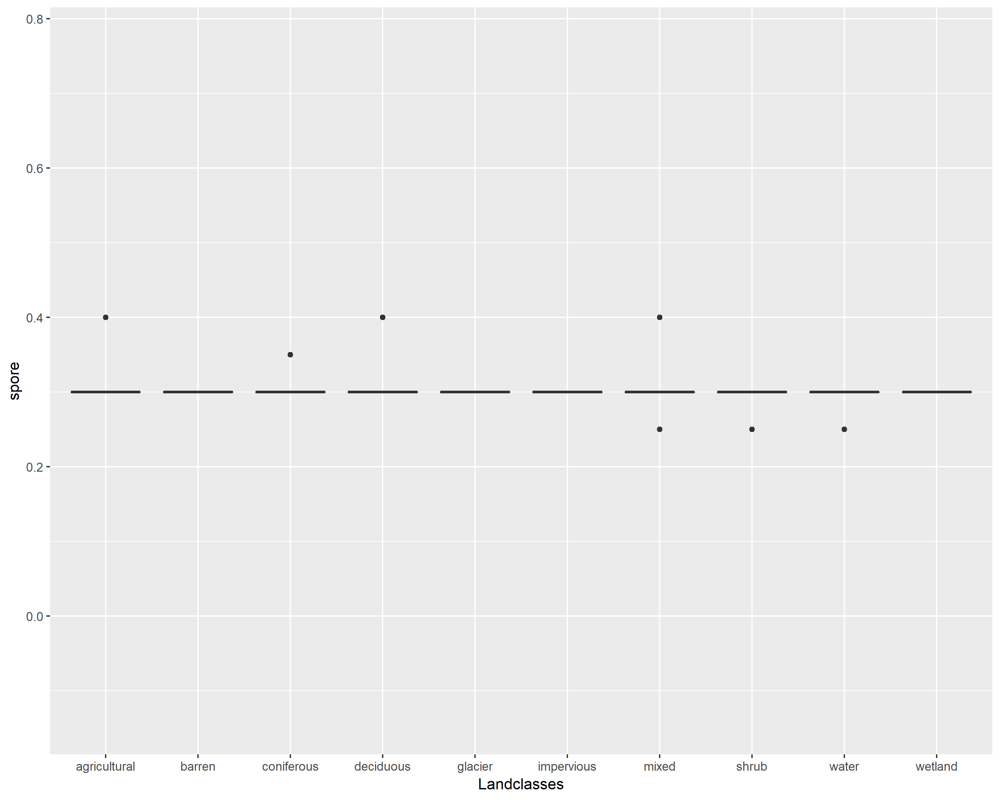

References
==========

Abbasnezhadi, K. 2017. Influence of meteorological network density on hydrological modeling using input from the Canadian Precipitation Analysis (CaPA). PhD thesis, University of Manitoba.

Bingeman, A.K. 2001. Improving dam safety analysis by using physically-based techniques to derive estimates of atmospherically maximum precipitation. PhD thesis, University of Waterloo.

Bohrn, S.K. 2012. Climate change impact assessment and uncertainty analysis of the hydrology of a northern, data-sparse catchment using multiple hydrological models. MSc thesis, University of Manitoba.

Carlaw, S.M. 2000. Soil moisture accounting in distributed hydrologic modelling. MSc thesis, University of Waterloo.

Delavau, C. 2016. Development of precipitation S18O isoscapes for canada and application within a tracer-aided hydrological model. PhD thesis, University of Waterloo.

Holmes, T.L. 2016. Assessing the value of stable water isotopes in hydrologic modeling: a dual-isotope approach. MSc thesis, University of Manitoba.

Jenkinson, R.W. 2010. Surface water quality modelling considering riparian wetlands. Transport. PhD thesis, University of Waterloo.

Jing, L., and B. Chen. 2011. Hydrological modeling of subartic wetlands: comparison between SLURP and WATFLOOD. Environmental Engineering Science 28, no. 7: 521-533.

Klyszejko, E.S. 2006. Hydrologic validation of real - time weather radar VPR correction methods. MSc thesis, University of Waterloo.

Kouwen, N. 2018. Personal Communication

Neff, T. 1996. Mesoscale water balance of the boreal forest using operational evapotranspiration approaches in a distributed hydrologic model. MSc thesis, University of Waterloo.

Seglenieks, F. 2009. Creation of a gridded time series of hydrological variables for Canada. PhD thesis, University of Waterloo.

Code
====

The code to process the parameter sets and output the table and plots is shown below. To execute the code locally, either copy it into a new R script, or change the 'eval=FALSE' to 'eval=TRUE' in this Rmarkdown file.

``` r
remove(list = ls())
library(stringr)
library(reshape2)
library(ggplot2)

options("scipen"=100, "digits"=4)
script.directory <- getwd()

#define folders
csv.directory <- file.path(script.directory, "ParameterSets")
output.directory <- file.path(script.directory, "Output")

#Create folders if they don't exist
dir.create(csv.directory, showWarnings = FALSE)
dir.create(output.directory, showWarnings = FALSE)


#Define function to read a single parameter set
ReadParameterCsv <- function(path.to.csv) {
  #read the parameters
  param.df <- read.csv(path.to.csv, stringsAsFactors = FALSE)
  
  #parse the file name for attributes
  filename.parse <- str_split(basename(path.to.csv), "_")[[1]]
  
  classtype <- filename.parse[1]
  author <- filename.parse[2]
  set.number <- filename.parse[3]
  basin <- str_remove(filename.parse[4], ".csv")
  
  output <- cbind(param.df, classtype, author, set.number, basin)
  output.long <-
    melt(
      output,
      id.vars = c("Parameter", "classtype", "author", "set.number", "basin"),
      stringsAsFactors = FALSE
    )
  
  return(output.long)
  
}


#######Get the parameter sets and change to long format#############
#get a list of all the paramter files
csv.files <- file.path(csv.directory, list.files(csv.directory))

#read all the parameter files and store in a list
dat <- lapply(csv.files, ReadParameterCsv)
long.param.df <- do.call(rbind, dat)
long.param.df$variable <-
  as.character(long.param.df$variable) #convert from factor to string
Data <- long.param.df #copy over data to use in next step


########Format the attributes#######################################
#convert all attributes to lower case and remove '_' and numbers
Data <-
  as.data.frame(sapply(Data, tolower), stringsAsFactors = FALSE)
Data$value <- as.numeric(Data$value)
Data$variable <- str_replace_all(Data$variable, "[0123456789_.]", "")

#standardize parameter names
Data$Parameter <- str_replace_all(Data$Parameter, "mf", "fm")
Data$Parameter <- str_replace_all(Data$Parameter, "nfm", "fmn")
Data$Parameter <- str_replace_all(Data$Parameter, "lzf", "flz")
Data$Parameter <- str_replace_all(Data$Parameter, "r2n", "r2")
Data$Parameter <- str_replace_all(Data$Parameter, "r1n", "r1")
Data$Parameter <-
  str_replace_all(Data$Parameter, "\\bre\\b", "rec") #note that \\b means start or end of word https://stackoverflow.com/questions/24241744/how-do-i-replace-an-exact-pattern-in-a-string-in-r
Data$Parameter <-
  str_replace_all(Data$Parameter, "sublime", "sublim_rate")
Data$Parameter <- str_replace_all(Data$Parameter, "albedo", "alb")

#reclassify some landcovers
Data$variable <-
  str_replace_all(Data$variable, "grass", "agricultural")
Data$variable <-
  str_replace_all(Data$variable, "crops", "agricultural")


#remove 'default' landclass
Data <- Data[Data$variable != "default", ]
#categorize by variable type
Data$Param_type <- factor(Data$Parameter)
levels(Data$Param_type) <- list(
  landclass = c(
    "ds",
    "dsfs",
    "rec",
    "ak",
    "akfs",
    "retn",
    "ak2",
    "ak2fs",
    "r3",
    "r3fs",
    "r4",
    "fpet",
    "ftall",
    "flint",
    "fcap",
    "ffcap",
    "spore",
    "fratio",
    "fm",
    "base",
    "fmn",
    "tipm",
    "rho",
    "whcl",
    "alb",
    "sublim_rate"
  ),
  riverclass = c("flz", "pwr", "r2", "r1", "theta", "kcond", "mndr"),
  global = c("a5")
)

Data <- Data[complete.cases(Data), ]


###########Find stats and export to csv####################
#Find the min and max values - output to csv
mins <- aggregate(Data$value,
                  by = list(Data$Parameter),
                  min,
                  na.rm = T)
maxes <-
  aggregate(Data$value,
            by = list(Data$Parameter),
            max,
            na.rm = T)
lower <-
  aggregate(Data$value,
            by = list(Data$Parameter),
            quantile,
            0.05,
            na.rm = T)
upper <-
  aggregate(Data$value,
            by = list(Data$Parameter),
            quantile,
            0.95,
            na.rm = T)
median <-
  aggregate(Data$value,
            by = list(Data$Parameter),
            quantile,
            0.50,
            na.rm = T)
maxmin_table <- cbind(mins,
                      maxes[, 2],
                      lower[, 2], 
                      upper[, 2], 
                      median[, 2])
names(maxmin_table) <-
  c("Parameter", "min", "max", "fifth", "ninetyfifth", "median")

#round to 4 decimal places
maxmin_table[,-1] <- round(maxmin_table[,-1],4)

#remove Fpet and Ftall because they should use textbook values
maxmin_table <- maxmin_table[!(maxmin_table$Parameter %in% c("fpet","ftall")),]

write.csv(maxmin_table, file.path(output.directory, "SummaryTable.csv"))


###############Now plot everything###########################
#https://stats.stackexchange.com/questions/11406/boxplot-with-respect-to-two-factors-using-ggplot2-in-r


#First plot the landclasses parameters

#define a landclass plotting function
plotlandclasses <- function(parameter, data = Data) {
  subdata <- data[data$Parameter == parameter , ]
  ylim1 <- boxplot.stats(subdata$value)$stats[c(1, 5)]
  
  p <-
    ggplot(data[data$Parameter == parameter , ], aes(x = variable, y = value)) +
    geom_boxplot() +  ylab(parameter) + xlab("Landclasses") + 
    coord_cartesian(ylim = ylim1 * 1.05)
  ggsave(file.path(output.directory, paste0("Param_Land_", parameter, ".png")),
         p,
         width = 10,
         height = 8)
}

#create a plot for each landclass and save
landclassdata <- Data[Data$Param_type == "landclass", ]
parameters <- unique(landclassdata$Parameter)
lapply(parameters, plotlandclasses, data = landclassdata)


#Second plot the riverclass parameters

#define a riverclass plotting function
plotriverclasses <- function(parameter, data = Data) {
  subdata <- data[data$Parameter == parameter , ]
  ylim1 <- boxplot.stats(subdata$value)$stats[c(1, 5)]
  
  p <- ggplot(subdata, aes(x = basin,  y = value)) +
    geom_boxplot() +  ylab(parameter) + xlab("Riverclasses") + 
    coord_cartesian(ylim = ylim1 * 1.05)
  ggsave(file.path(output.directory, paste0("Param_River_", parameter, ".png")),
         p,
         width = 10,
         height = 8)
}

#create a plot for each riverclass and save
riverclassdata <- Data[Data$Param_type == "riverclass", ]
parameters <- unique(riverclassdata$Parameter)
lapply(parameters, plotriverclasses, data = riverclassdata)
```
